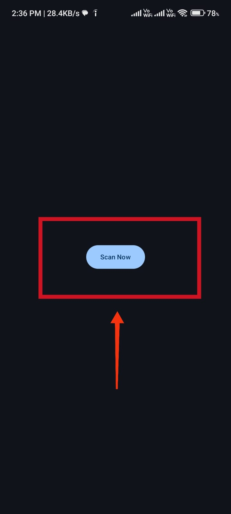
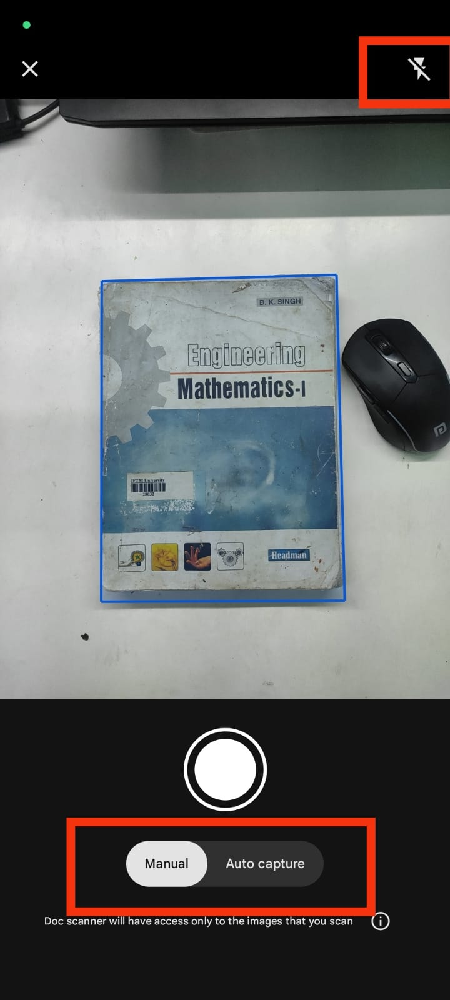
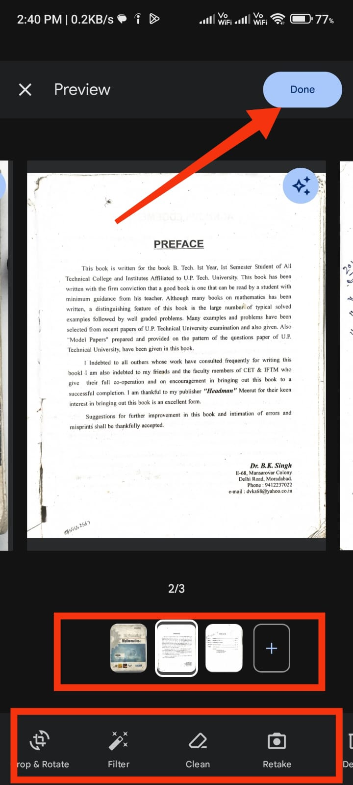
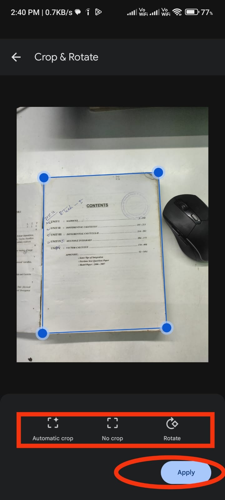
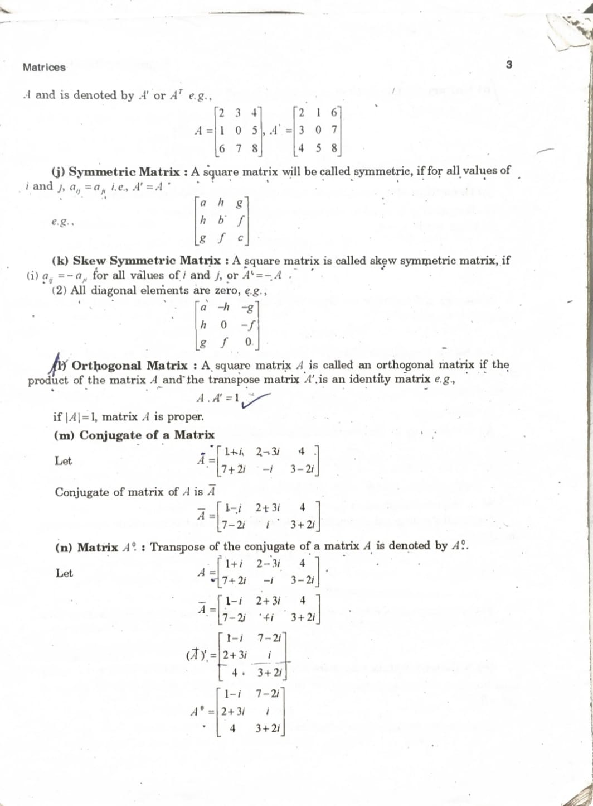
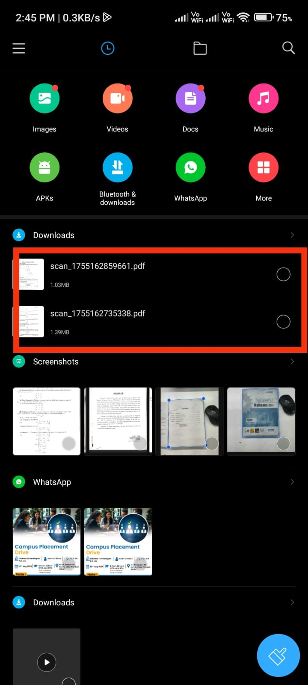

# 📄 AI Document Scanner (Android + Google ML Kit)

An AI-powered **document scanning app** built with **Google ML Kit** on Android.  
It detects document edges, crops automatically, and enhances clarity — all directly on your device.

---

## ✨ Features

- **Smart Edge Detection** – Automatically detects the boundaries of your document.
- **Auto Cropping** – Precisely crops the document based on detected edges.
- **Image Enhancement** – Improves brightness, contrast, and sharpness.
- **Offline Processing** – Works without internet, keeping your data private.
- **Multi-Format Export** – Save as JPEG or PDF.
- **User-Friendly UI** – Simple, clean, and intuitive design.

---

## 📱 Screenshots

| Capture | Process | Enhance |
|---------|---------|---------|
|  |  |  |

| Save PDF | Document List | Settings |
|----------|--------------|----------|
|  |  |  |


## 🚀 Getting Started

### 1️⃣ Clone the Repository
```bash
git clone https://github.com/your-username/document-scanner-mlkit.git
cd document-scanner-mlkit


